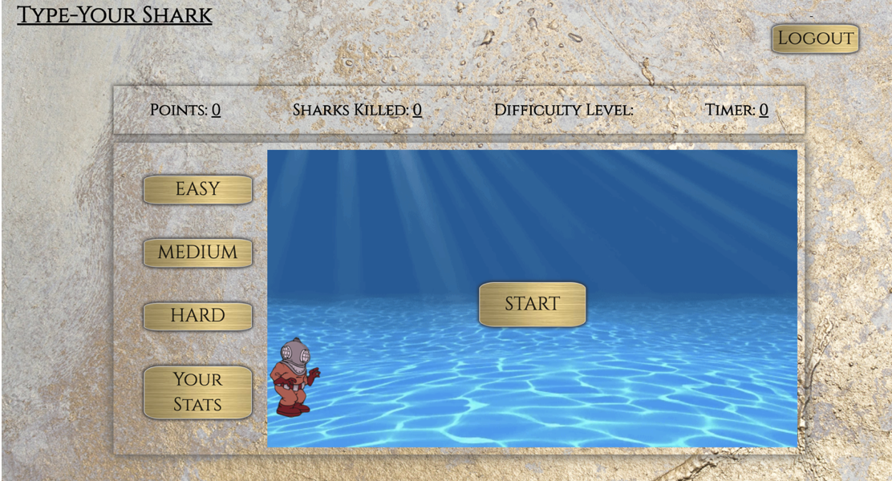
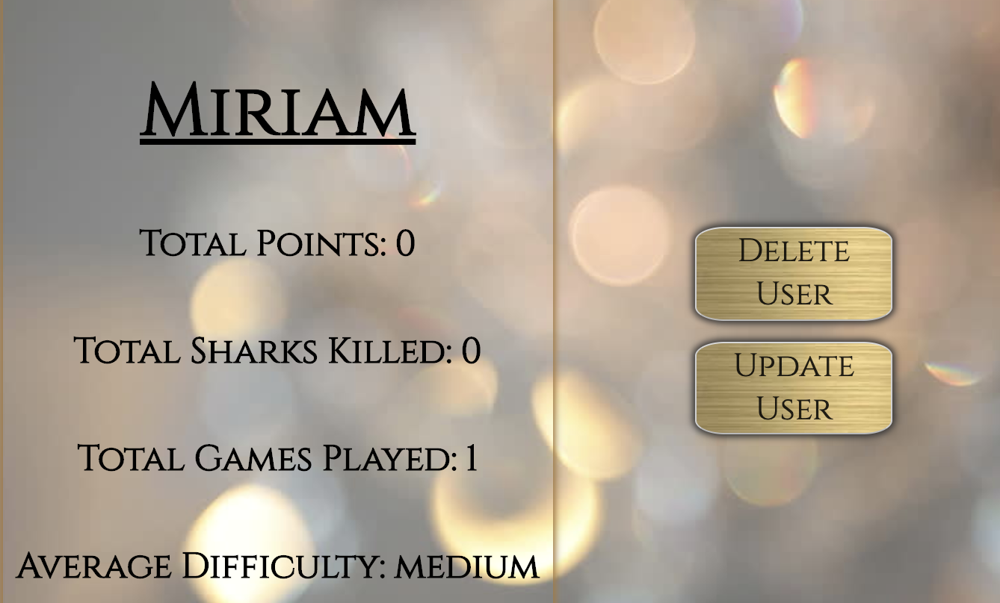
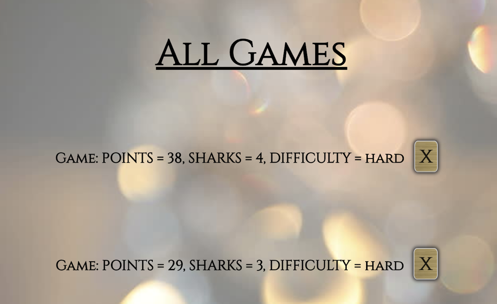
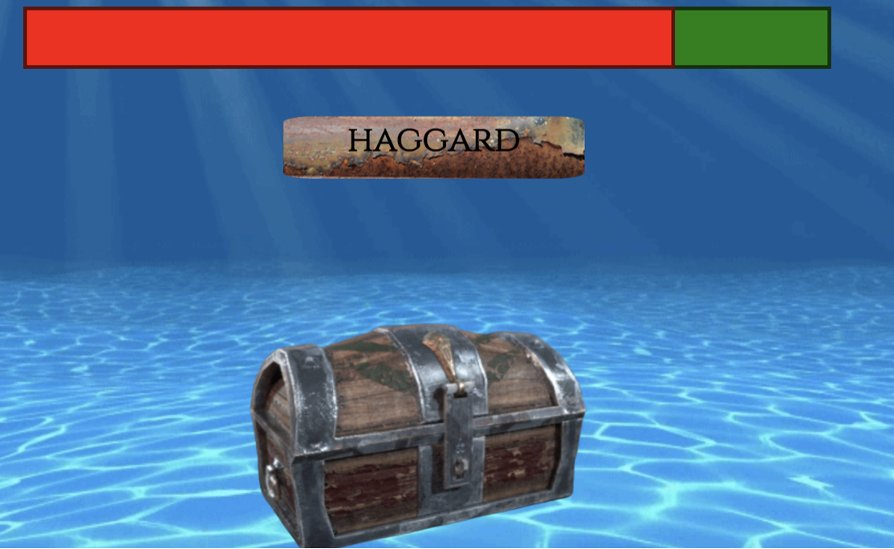

# Type Your Shark

A simple typing game with 3 levels of difficulty and 3 challenge levels to test and improve your typing proficiency. 

## Motivation

Type Your Shark is loosely based on the original flash game Typer Shark that no longer exists. It was a game used to increase typing speed and accuracy. Type Your Shark is my take on the original to target programmers. I achieved this with long and obscure words and a "spell-check" level to sharpen necessary programming skills in 3 challenging ways. The goal was to cut down on typos and mistakes to maximize the individual's coding flow, while still having fun. 

## Getting Started

If you wish to fork/clone the repo, do so in conjunction with the frontend found at [FrontEnd Repo](https://github.com/miriamgrigsby/type-your-shark-frontend). 

### Ruby Version 

ruby 2.6.1p33 (2019-01-30 revision 66950) [x86_64-darwin19]

### Rails Version

Rails 6.0.2.1

### Tech Stack

Ruby on Rails Backend with a PostgreSQL database 

Vanilla JavaScript with some jQuery 

### Installation

The app back is built with a PostgreSQL database and Ruby on Rails which requires the following commands to run: 

    Run bundle to install the gems if using Bundler

    Run rails db:create
    
    Run rails db:migrate

    Run rails s to start the server
    
The app front is built with Vanilla JavaScript and jQuery requires the following commands to run: 
    
    Run lite-server
    
### Features

Type Your Shark features animations and simple game functionality using plain JavaScript and CSS. Game and user stats  update and delete with optimistic and pessimistic rendering to improve user experience. The app also has full Authentication using JWT and is a Single-Page-App. 

### Words API

The words appended to the creatures are randomly chosen from an imported JavaScript file words.js with 170,000+ words. 

### Operation Overview

User can login or create a new account at which point, the game is available for play. Signing up automatically logs the user in. The user can choose between 3 difficulties and play through 3 levels. At the end of each game, the database is updated to save that game instance to the user, or updated depending on the level. The user can delete or update their user information, or delete any game at any point in the My Stats tab. The user can see all of their individual games as well as an average of all of their stats. All data persists refresh. The user can also logout. 

### Deciding the Level

Each level varies in difficulty through the following properties:
    Shark overall speed
    number of sharks appended in the game time
    length of word on the shark
    
### Level 1 
    
Sharks begin to swim towards the diver. The objective is type the letters on the red shark. Each letter is checked for correctness and turns green upon meeting this condition. Once the whole word is correct, the shark is removed (no need to press enter), and the next shark turns red. Kill all the sharks on the screen before they reach the diver. Even if time runs out, you must kill all the sharks. 

### Speed Round (Level 2)

After completing level 1, the user is brought to a bonus speed round. Type all the words as quickly as you can. Careful, typing the wrong letter decrements your time. Type the whole word correctly and gain a little time. Play until the time runs out, then collect your ruby from the treasure chest to move on. This level cannot be lost.

### Boss Round (Level 3

Toxic sharks and ghost piranhas alternate in a (1:1, 1:2, 1:3) ratio depending on difficulty. Toxic sharks are always 4 letters, that when not typed quickly morph. Ghost piranhas are grayed out until they are partially on the screen and have a single character on them. All creatures must be typed correctly before they reach the diver. 25 seconds after the beginning on the level, a boss shark emerges. The boss sends cannonballs concurrently that start halfway across the screen. Type all the cannonballs before they reach the diver to slowly kill the boss. A life bar at the top of the screen indicates the health of the boss. Time is unlimited now. Stay alive, and take down the boss to win the game! 

## Deployment

The app is fully deployed. 

* [Deployed Website front-end](https://type-your-shark.firebaseapp.com/)

## Video Walk Through

* [Walk Through Video]()
